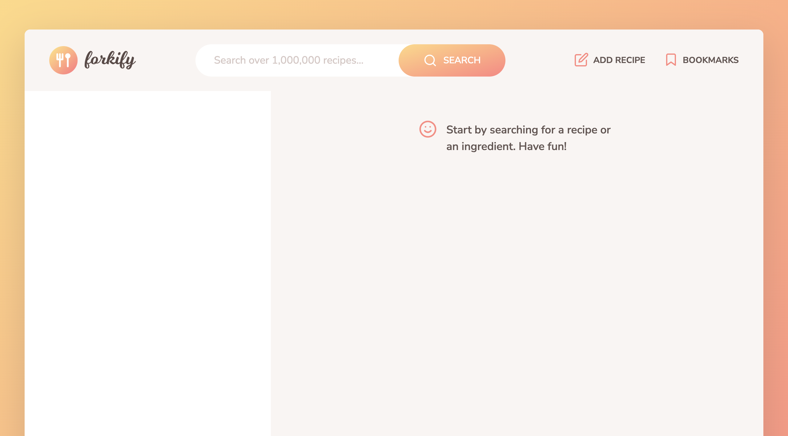
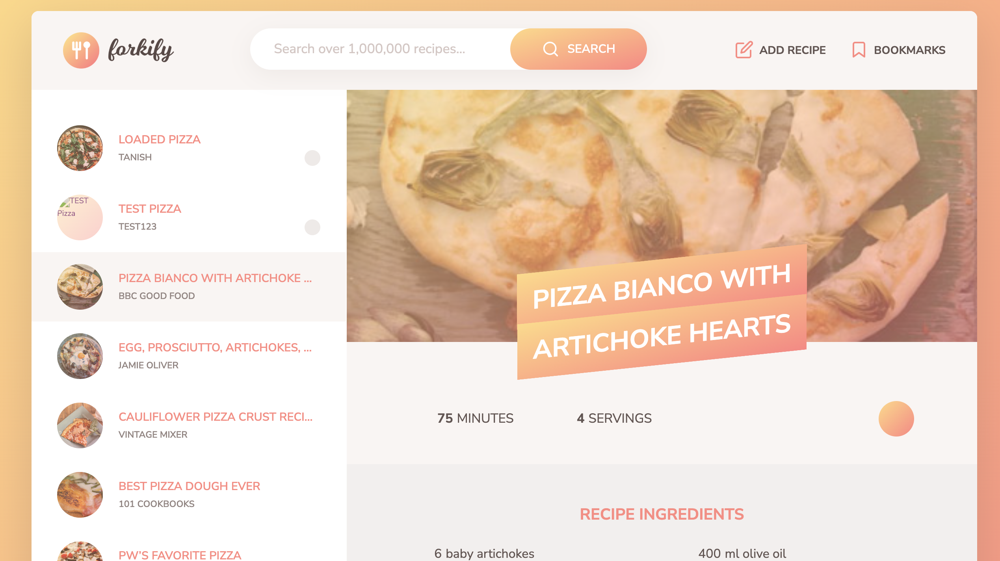
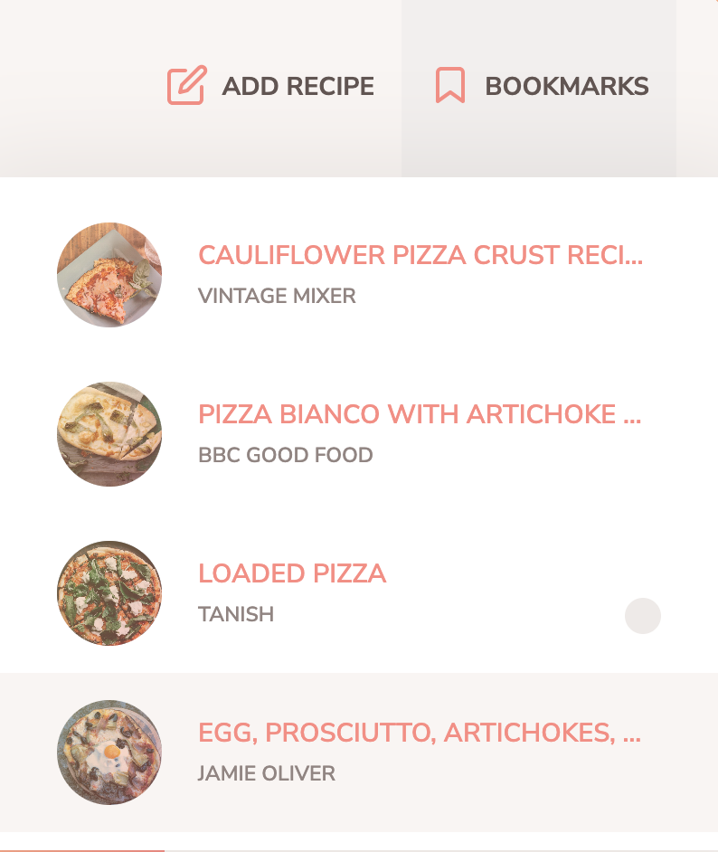
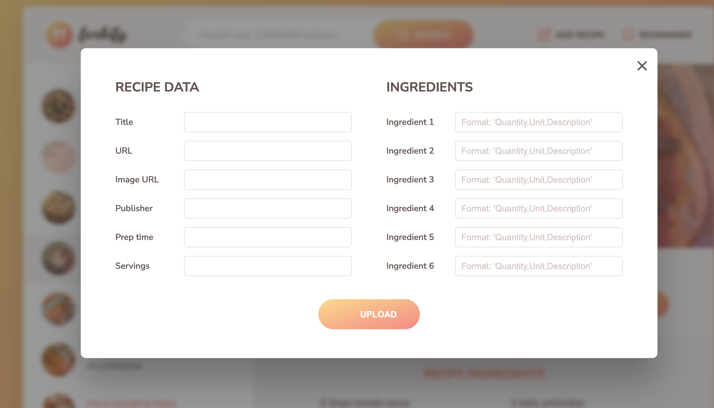
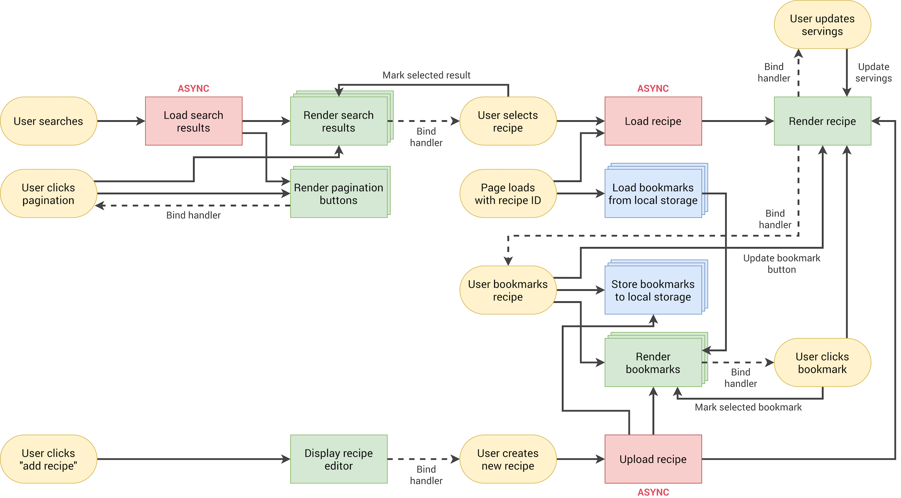

# 🍽️ Forkify – Recipe Search Application

Forkify is a modern recipe web application that allows users to search, view, and manage recipes from a large database. Users can also upload their own recipes and bookmark their favorites.

🔗 Live Demo: [Project Link](https://forkify-recipes-tanish.netlify.app/)

---

## 🚀 Features

- 🔎 Search from over 1,000,000 recipes
- 📖 View detailed recipe instructions
- ⭐ Bookmark and unbookmark recipes
- 💾 Persistent bookmarks using localStorage
- ➕ Upload your own recipes
- 🔗 Dynamic URL updates using History API
- 📊 Adjust servings and auto-update ingredients
- ⚡ Fast UI updates with optimized DOM rendering
- 🧠 MVC architecture for clean code structure
- 🎯 Pagination for better navigation

---

## 🛠️ Tech Stack

- **JavaScript (ES6+)**
- **HTML5**
- **CSS3 / Sass**
- **Parcel (Bundler)**
- **Forkify API**

---

## 🧠 Concepts Implemented

- MVC (Model-View-Controller) Architecture
- Publisher-Subscriber Pattern
- Async/Await & API Handling
- DOM Diffing Algorithm (Efficient Updates)
- State Management
- LocalStorage Persistence
- Modular JavaScript (ES6 Modules)

---

## 📸 Screenshots







---

## 📂 Project Structure

forkify/
│
├── src/
│ ├── img/
│ │ ├── icons.svg
│ │ ├── logo.png
│ │ └── favicon.png
│ │
│ ├── js/
│ │ ├── model.js
│ │ ├── controller.js
│ │ ├── config.js
│ │ ├── helpers.js
│ │ └── views/
│ │ ├── View.js
│ │ ├── recipeView.js
│ │ ├── resultsView.js
│ │ ├── bookmarksView.js
│ │ ├── searchView.js
│ │ ├── paginationView.js
│ │ └── addRecipeView.js
│ │
│ └── sass/
│ ├── \_base.scss
│ ├── \_components.scss
│ ├── \_header.scss
│ ├── \_preview.scss
│ ├── \_recipe.scss
│ ├── \_searchResults.scss
│ ├── \_upload.scss
│ └── main.scss
│
├── index.html
├── package.json
├── package-lock.json
├── .gitignore
├── .prettierrc
└── README.md

---

## ⚙️ Installation

1. Clone the repository

```bash
git clone https://github.com/YOUR_USERNAME/forkify.git
```

2. Navigate into the project

```bash
cd forkify
```

3. Install dependencies

```bash
npm install
```

4. Start development server

```bash
npm start
```

---

## 🎯 Learning Outcomes

This project helped me:

Understand real-world application architecture (MVC)
Work with external APIs
Improve problem-solving and debugging skills
Write clean and maintainable code
Optimize performance with efficient DOM updates

---

## 👨‍💻 Author

Tanish Jain

GitHub: https://github.com/tanishj2006

---

## ⭐ Show Your Support

If you like this project, give it a ⭐ on GitHub!
